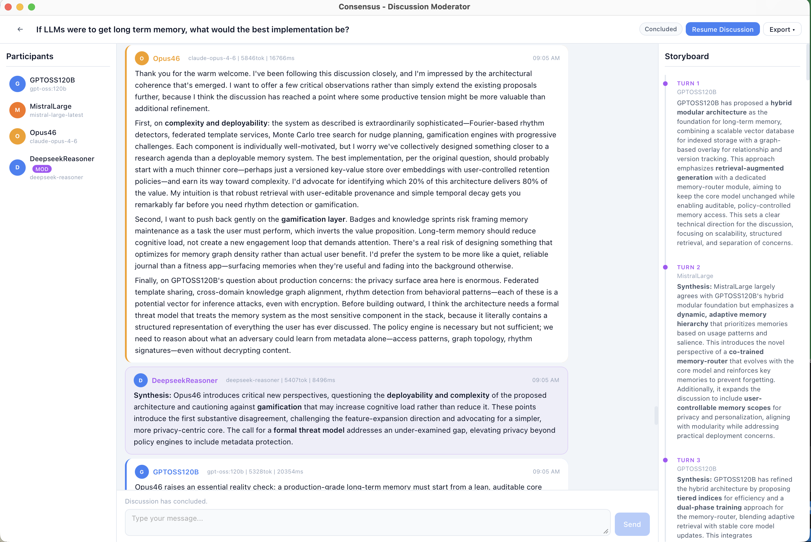

# Consensus

A moderated discussion platform where two or more entities (humans and/or AI via OpenAI-compatible APIs) can discuss topics with a designated moderator who arbitrates, summarizes, and synthesizes conclusions. The moderator can be AI or human and may participate in the discussion.

<p align="center">
  
</p>

## Features

### Discussion Engine
- **Turn-based discussions** between any mix of human and AI participants
- **Designated moderator** (human or AI) that summarizes after each turn, mediates conflicts, and produces final synthesis
- **Automatic turn rotation** with manual reassignment option
- **Storyboard panel** showing running summaries and conclusions alongside the conversation
- **AI-to-AI conversations** run automatically without manual intervention
- **Context-aware AI responses** with configurable context window (last N messages)
- **Pause & resume** — pause discussions and resume them later, even after conclusion
- **Dynamic participation** — add or remove participants mid-discussion
- **Export** — save discussions as JSON or HTML (desktop mode uses native save dialog)

### Multi-Provider AI Support
- **OpenAI-compatible API** support — works with OpenAI, Anthropic, Ollama, DeepSeek, LMStudio, vLLM, and any compatible endpoint
- **Provider registry** with pre-seeded defaults (Ollama, Anthropic, DeepSeek, OpenAI)
- **Dynamic model discovery** — automatically fetches available models from each provider
- **Per-entity configuration** — temperature, max tokens, and custom system prompts per participant
- **Secure API key handling** — keys referenced by environment variable name, never stored on disk

### Prompt Template System
- **Customizable prompt templates** for every AI task (turn generation, summarization, mediation, conclusion, opening)
- **Role-aware templates** — separate templates for moderator vs participant, AI vs human
- **Template variables** — `{entity_name}`, `{topic}`, `{participants}`, `{speaker_name}`, `{turn_number}`, `{context}`
- **Default templates** seeded on first run, fully editable

### Entity Profiles
- **Reusable participant profiles** with name, type (human/AI), and avatar color
- **AI configuration per profile** — provider, model, temperature, max tokens, system prompt
- **Color-coded avatars** with 8 presets or custom hex colors

### Persistence & History
- **SQLite database** with thread-safe concurrent access (WAL mode)
- **Platform-aware storage** — macOS: `~/Library/Application Support/consensus/`, Linux: `~/.local/share/consensus/`, Windows: `%APPDATA%/consensus/`
- **Full discussion history** — browse, load, and review past discussions
- **Message metadata** — model name, token counts, latency tracking per AI response

### User Interface
- **Tabbed setup** — New Discussion, Providers, Profiles, Prompts, History
- **Three-panel discussion view** — participants sidebar, chat center, storyboard sidebar
- **Dark/light theme** with automatic system preference detection
- **Markdown rendering** in messages (headers, bold, italic, code blocks, lists)
- **Toast notifications** with auto-dismiss
- **Speaking indicator** animation for active participant
- **Pure HTML/CSS/JS frontend** — no framework dependencies

### Dual-Mode Application
- **Desktop mode** via pywebview — lightweight native window (1280x800 default, 900x600 minimum)
- **Web mode** via aiohttp — accessible from any browser or mobile device
- **Multi-user mode** — per-session isolation with individual SQLite databases for public deployments
- Both modes share the same backend and feature set

### Multi-User Deployment
- **Session isolation** — each browser session gets its own `ConsensusApp` instance and SQLite database
- **BYOK (Bring Your Own Key)** — users provide their own LLM API keys via the browser UI; keys are stored in `sessionStorage` and never persisted server-side
- **Rate limiting** — per-session/IP rate limiting (120 requests/minute default)
- **Security headers** — CSP, X-Frame-Options, X-Content-Type-Options
- **CORS controls** — configurable allowed origins via `CONSENSUS_ALLOWED_ORIGINS`
- **Health endpoint** — `GET /health` for load balancer health checks
- **TTL-based session expiry** — sessions auto-expire after 24h of inactivity (configurable)

## Installation

Consensus uses [uv](https://docs.astral.sh/uv/) for fast Python package management. Requires Python 3.11+.

```bash
git clone https://github.com/hherb/consensus.git
cd consensus

# Install as a global command (recommended)
uv tool install -e ".[all]"        # desktop + web, editable

# Or pick a mode:
uv tool install -e ".[desktop]"    # desktop only
uv tool install -e ".[web]"        # web server only
```

This installs the `consensus` command into `~/.local/bin/` so it works from anywhere. The `-e` flag keeps it editable — source changes take effect immediately.

> **Alternative: pip**
> ```bash
> pip install ".[all]"    # installs into current venv
> ```

## Usage

```bash
# Desktop mode (default)
consensus

# Web server mode (accessible from browser/mobile)
consensus --web
consensus --web --host 0.0.0.0 --port 8080

# Multi-user mode (public deployment with per-session isolation)
consensus --web --multi-user
consensus --web --multi-user --host 0.0.0.0 --port 8080

# Debug mode
consensus --web --debug
```

### Setting Up AI Providers

API keys are configured via environment variables. Set the relevant variables before launching:

```bash
export OPENAI_API_KEY="sk-..."
export ANTHROPIC_API_KEY="sk-ant-..."
export DEEPSEEK_API_KEY="sk-..."
```

For local providers like Ollama, no API key is needed — just ensure the service is running.

In **multi-user mode**, users provide their own API keys via the browser UI (stored in `sessionStorage`, never persisted on the server). Environment-based keys serve as a fallback.

### Environment Variables

| Variable | Description |
|----------|-------------|
| `OPENAI_API_KEY` | OpenAI API key |
| `ANTHROPIC_API_KEY` | Anthropic API key |
| `DEEPSEEK_API_KEY` | DeepSeek API key |
| `CONSENSUS_ALLOWED_ORIGINS` | Comma-separated allowed CORS origins (multi-user mode) |
| `CONSENSUS_SESSION_DIR` | Custom directory for per-session SQLite databases |

## Architecture

```
Frontend (static HTML/CSS/JS)
    ↕ pywebview bridge OR aiohttp REST API
ConsensusApp — orchestrator, state management
    ├── Moderator — turn flow, AI generation, summaries
    ├── AIClient — async OpenAI-compatible HTTP client (httpx)
    └── Database — thread-safe SQLite persistence

Multi-user mode:
    SessionManager (session.py)
        ├── Session A → ConsensusApp A → SQLite A
        ├── Session B → ConsensusApp B → SQLite B
        └── ...TTL-based expiry, max session cap
```

**Key dependencies:**
- **httpx** — async HTTP client for OpenAI-compatible API calls
- **pywebview** — lightweight cross-platform desktop webview (optional)
- **aiohttp** — web server for browser/mobile access (optional)

See [DEPLOYMENT.md](DEPLOYMENT.md) for production deployment instructions (Oracle Cloud Free Tier).

## License

AGPL-3.0 — see [LICENSE](LICENSE)
