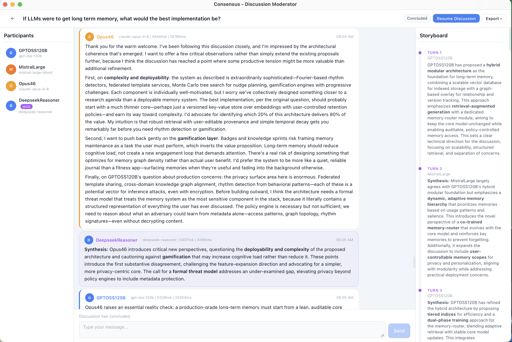

# Consensus

A collaborative intelligence platform that orchestrates structured reasoning between (optional) humans and AI models. Multiple participants — each with their own knowledge, tools, and analytical methods — work together under moderation to investigate questions, stress-test hypotheses, and synthesize conclusions. Supports thirteen analytical frameworks from Delphi estimation to adversarial red-teaming, with built-in web search, document RAG, vision, persistent memory, and extensible tooling via MCP.

<p align="center">
  
</p>

## Features

### Discussion Engine
- **Turn-based discussions** between any mix of human and AI participants
- **Designated moderator** (human or AI) that summarizes after each turn, mediates conflicts, and produces final synthesis
- **Automatic turn rotation** with manual reassignment option
- **Max rounds limit** — set a maximum number of rounds (auto-concludes when reached, 0 = unlimited)
- **Devil's Advocate role** — assign participants a constructive-critic role with dedicated prompt templates that challenge assumptions and identify weaknesses
- **Storyboard panel** showing running summaries and conclusions alongside the conversation
- **AI-to-AI conversations** run automatically without manual intervention
- **Participant-driven context loading** — each AI participant loads context from the database using a configurable strategy (full history, sliding window, or summary-compressed). Per-entity configuration with discussion-level defaults
- **Pause & resume** — pause discussions and resume them later, even after conclusion
- **Dynamic participation** — add or remove participants mid-discussion
- **Export** — save discussions as JSON or HTML (desktop mode uses native save dialog)

### Pluggable Discussion Methods
Different problems demand different reasoning structures. Consensus provides a `DiscussionMethod` abstraction that controls phases, prompts, response processing, and synthesis — while reusing the core infrastructure for turn-taking, message persistence, and tool execution.

- **Open Discussion** (default) — the standard moderated round-robin with optional Devil's Advocate; a solid general-purpose method
- **Analysis of Competing Hypotheses (ACH)** — from intelligence analysis. Participants enumerate all plausible hypotheses, gather evidence, then systematically rate each hypothesis against each piece of evidence (consistent/inconsistent/neutral). Focuses on *disconfirming* evidence and *diagnostic* evidence that distinguishes between hypotheses. Four phases: Hypothesise → Gather Evidence → Evaluate → Analyse
- **Belief State Diffusion** — an LLM-native method. Each participant maintains an explicit probability distribution over hypotheses (not prose opinions). Over multiple rounds, participants see others' distributions and reasoning, update their own beliefs, and show the math. Automatic convergence detection stops when belief deltas fall below a threshold. Produces graphable belief trajectories showing which arguments were actually persuasive. Three phases: Prior → Diffuse → Diagnose
- **Delphi Method** — independent anonymous responses across multiple rounds; facilitator shares statistical distribution and anonymised reasoning; participants revise. Avoids anchoring, authority bias, and social pressure. Phases: Estimate → Revise → Synthesise
- **Premortem Analysis** — assume a preliminary conclusion is reached, then each participant independently constructs a narrative of how and why it failed. Psychologically easier than critiquing a live idea. Phases: Frame → Premortem → Consolidate
- **Key Assumptions Check** — explicitly surface and challenge the assumptions underlying the question before analysis begins. Can function standalone or as a first phase in other methods. Phases: Surface → Challenge → Assess
- **Adversarial Collaboration** (Kahneman-style) — participants who genuinely disagree jointly design the criteria that would settle the question *before* gathering evidence. Prevents post-hoc rationalisation. Phases: Positions → Criteria → Evidence → Adjudicate
- **Red Team / Blue Team** — rotating adversarial role each round; red team sees only the current conclusion and tries to break it. Phases: Construct → Attack → Revise → Assess
- **Participant Voting** — structured deliberation followed by formal voting. Participants propose motions during deliberation, then vote for/against/abstain on each motion. Configurable thresholds (simple majority, supermajority, unanimous). Double-vote prevention, tally with pass/fail. Phases: Deliberate → Vote → Tally
- **Counterfactual Stress Testing** — systematically tests which beliefs are load-bearing vs. decorative in a developing consensus. For each key claim, participants argue from the premise that it is false and score the impact. Produces a ranked classification of claims by structural importance. Phases: Deliberate → Extract Claims → Stress Test → Synthesize
- **Recursive Decomposition** — breaks complex multi-faceted questions into manageable sub-questions, analyses each independently, then recomposes findings into a coherent synthesis. Phases: Decompose → Analyze Sub-questions → Integrate → Recompose
- **Recursive Self-Distillation** — an LLM-native method that separates persuasiveness from validity. Participants generate rich reasoning, then strip it to a pure logical skeleton (premises → inferences → conclusion). A blind evaluator assesses only the skeleton, preventing rhetorical flourishes from masking weak logic. Phases: Generate → Distill → Evaluate → Synthesize
- **Guided Triage** — a meta-method for collaborative method selection. The moderator interviews human participants about the problem type, decision context, and uncertainty structure, then an LLM-based recommender suggests the most appropriate method. The group confirms or adjusts before the discussion switches to the chosen method automatically. Phases: Intake → Recommend → Confirm

Methods are selected per-discussion at setup time, or recommended by the built-in **Method Recommender** — an LLM-based classifier that suggests the best method given a topic and answer type. The architecture is extensible — new methods implement the `DiscussionMethod` ABC and register in the method registry.

#### Composable Phase Library

Internally, all structured methods are built from **composable `PhaseHandler` instances** — self-contained units that encapsulate prompts, response processing, state initialization, and advancement logic for a single phase. Methods are assembled declaratively as ordered tuples of handlers:

```python
class KeyAssumptionsCheck(DiscussionMethod):
    phase_handlers = (
        SurfaceAssumptionsHandler(),
        ChallengeAssumptionsHandler(),
        AssessAssumptionsHandler(),
    )
```

This design means phases can be reused across methods (e.g. the same `SurfaceAssumptionsHandler` could serve as a first phase in another method), and new methods can be created by composing existing handlers without writing boilerplate. The library includes 43 handlers and 4 shared helper modules in `consensus/methods/phases/`.

### Multi-Provider AI Support
- **OpenAI-compatible API** support — works with OpenAI, Anthropic, Ollama, DeepSeek, LMStudio, vLLM, and any compatible endpoint
- **Provider registry** with pre-seeded defaults (Ollama, Anthropic, DeepSeek, OpenAI)
- **Dynamic model discovery** — automatically fetches available models from each provider
- **Per-entity configuration** — temperature, max tokens, and custom system prompts per participant
- **Secure API key handling** — keys referenced by environment variable name, never stored on disk
- **Retry with exponential backoff** — transient API failures (429, 5xx, timeouts) retry up to 3 times with backoff; failed participants are skipped gracefully

### Institutional Memory (Optional)
- **Long-term personal memory** — AI entities store and recall observations, positions, and insights across discussions
- **Semantic discussion search** — search past discussion messages by meaning, not just keywords
- **Knowledge graph** — AI entities assert and query structured concept/relationship triples (e.g. "free will contradicts hard determinism")
- **Proactive memory use** — default prompts encourage AI participants to recall past context before responding and store key insights after contributing
- **Per-entity memory** — each AI entity maintains its own private memory, scoped by entity ID
- **Graceful degradation** — if the embedding service (Ollama) is unavailable, discussions continue without memory; tools return informative errors
- **Opt-in per entity** — memory tools are assigned via the Profiles tab, keeping them invisible to entities that don't need them
- Requires: `uv pip install -e ".[memory]"` + [Ollama](https://ollama.com) running with an embedding model

### Document RAG (Optional)
- **Reference document ingestion** — add documents to a discussion by URL or inline text; supports PDF (via pdfplumber/PyPDF2), HTML (via trafilatura), and plain text/Markdown
- **Automatic chunking & embedding** — documents are split into overlapping chunks with paragraph-aware boundaries, then embedded in the background for semantic search
- **RAG-powered Q&A** — `doc_ask` retrieves the top-k most relevant chunks via cosine similarity and calls an LLM to answer with passage citations
- **Structured navigation** — `doc_get_sections`, `doc_get_chapter`, `doc_get_text` let participants browse documents by section headers or character ranges
- **Map-reduce summarization** — `doc_summary` handles arbitrarily long documents by summarizing chunks then synthesizing
- **Cross-discussion document library** — `doc_list` with `full_library=true` searches all documents across all discussions by semantic similarity
- **Per-discussion document binding** — documents are associated with specific discussions; participants see only relevant documents by default
- **Opt-in per entity** — document tools are assigned via the Profiles tab, like memory tools
- Requires: `uv pip install -e ".[memory]"` + [Ollama](https://ollama.com) running with an embedding model (shared infra with Institutional Memory)

### Prompt Template System
- **Customizable prompt templates** for every AI task (turn generation, summarization, mediation, conclusion, opening)
- **Role-aware templates** — separate templates for moderator vs participant, AI vs human
- **Template variables** — `{entity_name}`, `{topic}`, `{participants}`, `{speaker_name}`, `{turn_number}`, `{context}`
- **Default templates** seeded on first run, fully editable

### Entity Profiles
- **Reusable participant profiles** with name, type (human/AI), and avatar color
- **AI configuration per profile** — provider, model, temperature, max tokens, system prompt
- **Color-coded avatars** with 8 presets or custom hex colors

### Persistence & History
- **SQLite database** with thread-safe concurrent access (WAL mode)
- **File-based migration system** — versioned SQL migrations in `consensus/migrations/`, tracked in a `migrations` table, run idempotently on startup
- **Platform-aware storage** — macOS: `~/Library/Application Support/consensus/`, Linux: `~/.local/share/consensus/`, Windows: `%APPDATA%/consensus/`
- **Full discussion history** — browse, load, and review past discussions
- **Message metadata** — model name, token counts, latency tracking per AI response

### User Interface
- **Tabbed setup** — New Discussion, Providers, Profiles, Prompts, History
- **Three-panel discussion view** — participants sidebar, chat center, storyboard sidebar
- **Dark/light theme** with automatic system preference detection
- **Markdown rendering** in messages (headers, bold, italic, code blocks, lists)
- **Toast notifications** with auto-dismiss
- **Speaking indicator** animation for active participant
- **Pure HTML/CSS/JS frontend** — no framework dependencies

### Dual-Mode Application
- **Desktop mode** via pywebview — lightweight native window (1280x800 default, 900x600 minimum)
- **Web mode** via aiohttp — accessible from any browser or mobile device
- **Multi-user mode** — per-session isolation with individual SQLite databases for public deployments
- Both modes share the same backend and feature set

### Authentication (Multi-User Mode)
- **Email/password registration** with PBKDF2-SHA256 hashing (600k iterations, OWASP 2023)
- **OAuth sign-in** via GitHub, Google, LinkedIn, and Apple (Authorization Code flow)
- **Multiple OAuth identities** per user account (link GitHub + Google to the same account)
- **Secure token management** — SHA-256 hashed token storage, httpOnly cookies, 30-day TTL
- **CSRF protection** — Content-Type enforcement on all POST endpoints
- **Brute-force protection** — per-email rate limiting (5 attempts per 5-minute window)
- **Login/register UI** with OAuth provider buttons and form validation

### Cost Tracking
- **Automatic per-message cost calculation** using pricing data from OpenRouter
- **Model pricing cache** in SQLite with 7-day auto-refresh
- **Fuzzy model name matching** — handles naming variants (hyphens vs dots, date suffixes, provider prefixes)
- **Model aliases** for known name mappings (e.g. `deepseek-reasoner` → `deepseek/deepseek-r1`)
- **Per-message and per-discussion cost display** in the UI

### Interactive User Input
- **`ask_user` tool** — AI participants can pause mid-turn to request input from the human user
- **Inline input bubble** — question appears in the message flow with a textarea and submit button
- **Seamless continuation** — the user's response is fed back as a tool result; the AI continues its turn incorporating the answer
- **Reconnection-safe** — pending input requests survive page reloads via state synchronization
- **5-minute timeout** — graceful handling if the user doesn't respond
- Assign the `ask_user` tool to AI entities via the Profiles tab

### MCP Expert Plugins
- **MCP (Model Context Protocol) server integration** — register external MCP servers via JSON-RPC 2.0 over stdio (local processes) or Streamable HTTP (remote servers)
- **Dual transport** — stdio for local MCP servers (subprocess) and HTTP+SSE for remote MCP servers with session management (`Mcp-Session-Id`), retry with exponential backoff
- **Expert entities** — a new entity type (`expert`) that wraps an MCP tool as a consultable participant
- **`consult_expert` meta-tool** — AI participants can consult expert entities during turn generation; expert responses are added to the discussion
- **MCP server management** — add, update, test, and delete MCP server configurations via the UI; transport selector toggles between stdio and HTTP fields
- **Config file-based MCP servers** — load MCP server definitions from JSON or TOML config files at startup. Searches `CONSENSUS_MCP_CONFIG` env var, `./mcp_servers.json`, `~/.consensus/`, and the platform data directory. New servers are added to the DB; changed servers are updated
- **Real-time progress** — SSE endpoint (`GET /api/events`) for tool execution progress notifications
- **Event emitter** — lightweight pub/sub system in `ConsensusApp` for real-time event dispatch

### MCP Server for External AI Agents
- **Consensus as an MCP server** — the `consensus-mcp` command exposes Consensus data and operations to external AI agents (e.g. Claude Code) via stdio JSON-RPC 2.0
- **13 tools** for reading, searching, and writing:
  - **Passive:** `list_discussions`, `read_discussion`, `search_discussions`, `list_entities`, `search_memories`, `query_knowledge_graph`, `list_documents`, `read_document`, `search_documents`
  - **Active:** `store_memory`, `delete_memory`, `assert_knowledge`, `run_discussion`
- **Persistent agent memory** — the coding agent gets its own entity ("Claude Code Agent") with private long-term memory that persists across sessions
- **Run full discussions programmatically** — `run_discussion` creates, moderates, and concludes an AI discussion on any topic, returning the synthesised result
- **Memory deletion safeguards** — agents can only delete their own memories; ownership is hardcoded and double-enforced at the DB layer
- **Graceful degradation** — listing and reading tools work without an embedding service; semantic search tools return helpful errors if Ollama is unavailable

### Evaluation Framework
- **Ablation study platform** for testing multi-agent discussion configurations against medical case vignettes
- **10 seed cases** with gold diagnoses, key findings, and differential diagnoses
- **5 ablation conditions** — progressively complex setups from baseline single-agent to full multi-agent with Devil's Advocate, memory, and tools
- **Batch runner** with automated scoring (string-match + optional LLM-judge)
- **Per-participant provider/model overrides** — mix different AI backends within a single evaluation run
- **Web UI** at `/eval/` for case management, condition editing, batch execution, and results analysis
- Accessible from both desktop mode (opens in browser) and web mode

### Multi-User Deployment
- **Session isolation** — each browser session gets its own `ConsensusApp` instance and SQLite database
- **BYOK (Bring Your Own Key)** — users provide their own LLM API keys via the browser UI; keys are stored in `sessionStorage` and never persisted server-side
- **Rate limiting** — per-session/IP rate limiting (120 requests/minute default)
- **Security headers** — CSP, X-Frame-Options, X-Content-Type-Options
- **CORS controls** — configurable allowed origins via `CONSENSUS_ALLOWED_ORIGINS`
- **Health endpoint** — `GET /health` for load balancer health checks
- **TTL-based session expiry** — sessions auto-expire after 24h of inactivity (configurable)

## Installation

Consensus uses [uv](https://docs.astral.sh/uv/) for fast Python package management. Requires Python 3.11+.

```bash
git clone https://github.com/hherb/consensus.git
cd consensus

# Install as a global command (recommended)
uv tool install -e ".[all]"        # desktop + web, editable

# Or pick a mode:
uv tool install -e ".[desktop]"    # desktop only
uv tool install -e ".[web]"        # web server only
```

This installs the `consensus` command into `~/.local/bin/` so it works from anywhere. The `-e` flag keeps it editable — source changes take effect immediately.

> **Alternative: pip**
> ```bash
> pip install ".[all]"    # installs into current venv
> ```

## Usage

```bash
# Desktop mode (default)
consensus

# Web server mode (accessible from browser/mobile)
consensus --web
consensus --web --host 0.0.0.0 --port 8080

# Multi-user mode (public deployment with per-session isolation)
consensus --web --multi-user
consensus --web --multi-user --host 0.0.0.0 --port 8080

# Debug mode
consensus --web --debug
```

### MCP Server for AI Agents

Consensus includes an MCP server that lets external AI agents (like Claude Code) search discussions, query memories, and even trigger full discussions:

```bash
# Install (if not already)
uv pip install -e ".[all]"

# Test the server
echo '{"jsonrpc":"2.0","id":1,"method":"initialize","params":{}}' | consensus-mcp
```

To configure in Claude Code, add to your MCP settings:

```json
{
  "mcpServers": {
    "consensus": {
      "command": "consensus-mcp"
    }
  }
}
```

### Setting Up AI Providers

API keys are configured via environment variables. Set the relevant variables before launching:

```bash
export OPENAI_API_KEY="sk-..."
export ANTHROPIC_API_KEY="sk-ant-..."
export DEEPSEEK_API_KEY="sk-..."
```

For local providers like Ollama, no API key is needed — just ensure the service is running.

In **multi-user mode**, users provide their own API keys via the browser UI (stored in `sessionStorage`, never persisted on the server). Environment-based keys serve as a fallback.

### Environment Variables

| Variable | Description |
|----------|-------------|
| `OPENAI_API_KEY` | OpenAI API key |
| `ANTHROPIC_API_KEY` | Anthropic API key |
| `DEEPSEEK_API_KEY` | DeepSeek API key |
| `CONSENSUS_MCP_CONFIG` | Path to MCP server config file (JSON or TOML); overrides default search paths |
| `CONSENSUS_ALLOWED_ORIGINS` | Comma-separated allowed CORS origins (multi-user mode) |
| `CONSENSUS_SESSION_DIR` | Custom directory for per-session SQLite databases |
| `CONSENSUS_EMBEDDING_ENDPOINT` | Ollama endpoint for embeddings (default: `http://localhost:11434`) |
| `CONSENSUS_EMBEDDING_MODEL` | Embedding model name (default: `nomic-embed-text-v2-moe:latest`) |
| `CONSENSUS_BASE_URL` | Public base URL for OAuth redirects (e.g. `https://yourdomain.com`) |
| `CONSENSUS_GITHUB_CLIENT_ID` | GitHub OAuth app client ID |
| `CONSENSUS_GITHUB_CLIENT_SECRET` | GitHub OAuth app client secret |
| `CONSENSUS_GOOGLE_CLIENT_ID` | Google OAuth client ID |
| `CONSENSUS_GOOGLE_CLIENT_SECRET` | Google OAuth client secret |
| `CONSENSUS_LINKEDIN_CLIENT_ID` | LinkedIn OAuth client ID |
| `CONSENSUS_LINKEDIN_CLIENT_SECRET` | LinkedIn OAuth client secret |
| `CONSENSUS_APPLE_CLIENT_ID` | Apple OAuth client ID |
| `CONSENSUS_APPLE_CLIENT_SECRET` | Apple OAuth client secret |

## Architecture

```
Frontend (static HTML/CSS/JS)
    ↕ pywebview bridge OR aiohttp REST API
ConsensusApp — orchestrator, state management, event emitter
    ├── app_providers.py — provider management
    ├── app_entities.py — entity CRUD
    ├── app_discussion_setup.py — discussion creation & configuration
    ├── app_discussion_flow.py — turn flow operations
    ├── app_discussion_state.py — discussion state management
    ├── Moderator — turn flow, AI generation, summaries
    ├── DiscussionMethod (methods/) — pluggable analytical frameworks
    │     ├── PhaseHandler (methods/phase_handler.py) — composable phase ABC
    │     ├── 13 method classes assembled from 43 phase handlers
    │     └── methods/phases/ — reusable handler implementations + helpers
    ├── ContextStrategies (context_strategies.py) — per-participant DB context loading
    ├── AIClient — async OpenAI-compatible HTTP client (httpx)
    ├── Database (db/) — thread-safe SQLite persistence (domain-specific mixins)
    ├── PricingCache — model cost lookup via OpenRouter
    ├── MCPToolProvider — MCP stdio transport (JSON-RPC 2.0 over subprocess)
    ├── MCPHTTPToolProvider — MCP Streamable HTTP transport (JSON-RPC 2.0 over HTTP+SSE)
    ├── DocumentRAG (tools_document.py) — document ingestion, chunking, RAG Q&A
    ├── AskUser (tools_ask_user.py) — interactive user input during AI turns
    ├── Migrator — file-based SQL migration runner
    └── Evaluation — ablation study framework (cases, runner, scorer)

MCP server (consensus-mcp):
    ConsensusMCPServer (mcp_server.py)
        ├── Database — direct SQLite access (read/search/write)
        ├── EmbeddingClient — semantic search via Ollama
        └── ConsensusApp — programmatic discussion orchestration

Multi-user mode:
    SessionManager (session.py)
        ├── Session A → ConsensusApp A → SQLite A
        ├── Session B → ConsensusApp B → SQLite B
        └── ...TTL-based expiry, max session cap
```

**Key dependencies:**
- **httpx** — async HTTP client for OpenAI-compatible API calls
- **pywebview** — lightweight cross-platform desktop webview (optional)
- **aiohttp** — web server for browser/mobile access (optional)
- **sqlite-vec** + **numpy** — vector similarity search for institutional memory and document RAG (optional)
- **pdfplumber** — PDF document parsing for document RAG (optional)

See [DEPLOYMENT.md](DEPLOYMENT.md) for production deployment instructions (Oracle Cloud Free Tier).

## License

AGPL-3.0 — see [LICENSE](LICENSE)
