# Consensus: Collective Intelligence Through Structured Deliberation

## Beyond Chat — Toward Systematic Inquiry

Most AI applications today follow a simple pattern: one human, one model, one conversation. This works well for quick questions and drafting tasks, but it falls apart when problems demand rigour. Complex questions — the kind that shape policy, guide medical decisions, or determine architectural trade-offs — require multiple perspectives, adversarial testing, accumulated knowledge, and access to verifiable evidence. They require *deliberation*, not just generation.

Consensus is built around a different premise: that the most reliable path to understanding runs through structured, multi-party discussion — moderated, evidence-grounded, and persistent. The platform integrates institutional memory, adversarial roles, document ingestion, specialist plugins, and — crucially — a growing library of *discussion methods* that go beyond open debate to include formal analytic techniques and novel LLM-native reasoning approaches.

This is not an isolated idea. A growing body of research — from Du et al.'s foundational work showing that [multi-agent debate improves factuality and reasoning](https://composable-models.github.io/llm_debate/) in language models, to recent surveys on [memory in LLM-based multi-agent systems](https://www.techrxiv.org/users/1007269/articles/1367390), to empirical studies demonstrating that [LLM-powered devil's advocates significantly improve group decision accuracy](https://dl.acm.org/doi/10.1145/3640543.3645199) — confirms that the principles underlying Consensus are sound. What Consensus adds is the integration: combining these individually validated techniques into a single, usable platform — and then going further, exploiting capabilities that LLMs have and humans fundamentally do not.

## Institutional Memory: Learning Across Conversations

Human experts do not approach each problem from scratch. A physician draws on decades of cases. A senior engineer recalls how a similar system failed three years ago. Institutional knowledge — the accumulated understanding of an organisation or discipline — is what separates competent analysis from shallow reaction.

Consensus gives its AI participants this same capacity through three interlocking memory systems:

**Personal memory** allows each AI entity to store observations, positions, and insights that persist across discussions. An AI participant that has spent several sessions debating the ethics of algorithmic sentencing does not forget its earlier reasoning when the topic resurfaces months later. It can recall its own prior positions, notice when new evidence contradicts them, and evolve its thinking over time. This is not mere retrieval — it is the foundation for intellectual continuity.

**Semantic search over past discussions** indexes the full corpus of prior conversations using vector embeddings (via Ollama and models like `nomic-embed-text`). Any participant can search not just for keywords but for *meaning* — finding relevant passages from earlier deliberations even when the vocabulary differs. A discussion about drug interactions can surface insights from a months-old conversation about metabolic pathways, because the system understands conceptual proximity, not just string matching.

**The knowledge graph** captures structured relationships between concepts: that a particular study *supports* a specific claim, that one architectural pattern *contradicts* another, that a philosophical position *implies* certain ethical commitments. Participants can assert new relationships and query existing ones, building a shared map of how ideas connect. Over time, this graph becomes a navigable representation of everything the group has learned together.

These are not passive archives. The system's default prompts actively instruct AI participants to search their memory before responding, to store key insights after contributing, and to record conceptual relationships as they emerge. Memory use is woven into the fabric of participation itself.

This approach resonates with recent work in the field. [Letta](https://github.com/letta-ai/letta) (formerly MemGPT) pioneered the idea of an OS-inspired memory hierarchy for AI agents — core memory, conversational memory, and archival memory — where agents actively manage what stays in context versus what gets stored externally. [Mem0](https://github.com/mem0ai/mem0) provides a lightweight open-source memory engine with graph-based storage. And the [MemOS](https://statics.memtensor.com.cn/files/MemOS_0707.pdf) preprint (July 2025) envisions a full "memory operating system" with conflict detection, deduplication, versioning, and forgetting policies. What distinguishes Consensus's memory architecture is its orientation toward *multi-party deliberation* rather than single-agent persistence: the knowledge graph and discussion corpus are shared resources that accumulate collective understanding, not just individual recall.

## The Devil's Advocate: Adversarial Rigour Without Hostility

Consensus and agreement feel productive, but they can be dangerous. Groupthink — the tendency of deliberating groups to converge on comfortable conclusions — is one of the most well-documented failures in collective decision-making. It has contributed to engineering disasters, medical errors, and policy failures.

The Devil's Advocate role in Consensus is a structural countermeasure. When a participant is assigned this role, the system does several things automatically:

**Specialised prompts** replace the standard participant instructions with a mandate for constructive critical analysis. The Devil's Advocate is directed to identify factual errors, logical fallacies, unsupported claims, unstated assumptions, and missing perspectives. Crucially, the instructions emphasise that this is not contrarianism for its own sake — the goal is to *strengthen* the discussion by subjecting every argument to honest scrutiny.

**Automatic tool assignment** gives the Devil's Advocate immediate access to web search and the full memory toolkit. The role's prompts explicitly require fact-checking claims made by other participants, searching for contradicting evidence, and grounding critiques in verifiable sources rather than mere assertion.

**Turn order placement** positions the Devil's Advocate last in each round of discussion. This is deliberate: by speaking after all other participants have contributed, the critic has the full picture of the round's arguments and can respond to the strongest versions of each position rather than attacking early, incomplete formulations.

**Single-advocate enforcement** ensures that only one participant holds this role at any time, preventing the discussion from devolving into a chorus of criticism. If a new Devil's Advocate is designated, the previous one reverts to a standard participant role.

The result is a discussion dynamic that mirrors the best practices of academic peer review, red-teaming in security, and moot court in legal education — adversarial testing conducted within a framework of mutual respect and shared purpose.

Empirical research validates this design. A 2024 study at the ACM Conference on Intelligent User Interfaces found that [groups with an LLM-powered devil's advocate showed significantly higher accuracy](https://dl.acm.org/doi/10.1145/3640543.3645199) on decision-making tasks, circumventing the limitations of traditional devil's advocacy where human dissenters often self-censor under social pressure. More recently, [Amplifying Minority Voices](https://arxiv.org/html/2502.06251v1) (February 2025) extends the concept toward equity, using AI-mediated devil's advocacy specifically to ensure marginalised perspectives are not drowned out. And the [RedDebate](https://arxiv.org/html/2506.11083v1) framework (June 2025) demonstrates that the same adversarial debate pattern can be turned inward — agents red-teaming each other to identify unsafe behaviours — suggesting that Consensus's Devil's Advocate role could serve double duty as a safety mechanism. The [D3 (Debate, Deliberate, Decide)](https://arxiv.org/html/2410.04663) framework formalises this further, defining role-specialised agents — advocates, judges, and optional juries — that map directly onto Consensus's existing architecture of moderator, participants, and Devil's Advocate.

## Document RAG: Shared Evidence Access

Consensus provides tools for ingesting and interrogating documents that all discussion participants can access. Any participant can request that a document — a research paper, a policy brief, a technical specification — be added to the discussion, whether discovered during a web search or supplied by a human user. Documents are chunked, embedded, and made searchable via RAG (Retrieval-Augmented Generation), allowing participants to ask questions of the source material and ground their arguments in specific passages.

This mirrors what a human research team does naturally: gathering relevant literature, sharing key papers, and referring back to specific evidence during deliberation. The difference is that AI participants can search the full text of every ingested document simultaneously, cross-referencing claims across sources in ways that would be prohibitively time-consuming for human readers.

Document RAG is orthogonal to the choice of discussion method — every approach described below benefits from shared evidence access.

## Discussion Methods: Beyond Open Debate

The default moderated discussion — participants taking turns, a moderator synthesising, a devil's advocate challenging — is a solid general-purpose framework. But different problems demand different structures. A factual question benefits from hypothesis testing. A forecasting problem benefits from calibrated probability estimates. A creative challenge benefits from systematic divergence.

Consensus addresses this through a `DiscussionMethod` abstraction: a pluggable system that controls phases, turn flow, prompt selection, and synthesis while reusing the existing infrastructure for message persistence, tool execution, and moderation. The open discussion becomes one method among several, each optimised for a different class of problem.

### Structured Analytic Techniques

These methods draw from established practices in intelligence analysis, forecasting, and structured argumentation — battle-tested approaches developed specifically to combat cognitive biases in group analysis.

#### Analysis of Competing Hypotheses (ACH)

Developed by the CIA for intelligence analysis, ACH inverts the natural tendency to seek confirmation. Instead of building toward a single conclusion, participants start with *all plausible hypotheses simultaneously* and systematically evaluate each piece of evidence against each one, looking specifically for *disconfirming* evidence.

Consensus implements ACH as a four-phase method:

1. **Hypothesise** — Each participant proposes candidate hypotheses. The moderator collects and deduplicates them into a hypothesis matrix.
2. **Gather Evidence** — Participants research the question using available tools (web search, document RAG, memory). Each piece of evidence is tagged against the hypotheses it bears on.
3. **Evaluate** — Each participant rates every hypothesis against every piece of evidence: consistent, inconsistent, or neutral. Results are aggregated into a matrix.
4. **Analyse** — The moderator identifies which evidence is *diagnostic* (actually differentiates between hypotheses), ranks hypotheses by inconsistency count (fewer inconsistencies = more plausible), and flags conclusions that depend on a single piece of evidence.

The key insight: ACH focuses attention on what *contradicts* rather than what *confirms*, and on evidence that *distinguishes* between alternatives rather than evidence that is merely consistent with a preferred hypothesis. This is precisely the reasoning failure that unstructured discussion is worst at preventing.

#### Delphi Method

Participants work independently and anonymously across multiple rounds. After each round, a facilitator shares the statistical distribution of responses plus anonymised reasoning. Participants then revise. This avoids anchoring, authority bias, and social pressure — all of which persist even with an adversary role.

The key insight: *discussion itself can be the problem*, not just groupthink within discussion. The Delphi method tests whether convergence is driven by evidence or by social dynamics.

#### Premortem Analysis

"Assume we reached conclusion X and it turned out to be wrong. Why?" This inversion is psychologically easier than critiquing a live idea. A Consensus implementation would have participants develop a preliminary conclusion through open discussion, then enter a premortem phase where each participant independently constructs a narrative of how and why that conclusion failed.

#### Key Assumptions Check

Before diving into analysis, explicitly surface and challenge the assumptions underlying the question itself. Often the framing is the problem. This can function as a standalone method or as a mandatory first phase in other methods.

#### Tournament / Superforecasting Approach

Based on Tetlock's work on superforecasting: instead of consensus, have participants make independent probabilistic estimates, then weight contributions by track record. The "answer" is a calibrated probability distribution, not an agreed narrative. This works especially well for empirical questions and naturally handles disagreement without forcing resolution.

#### Argument Mapping (Structured Argumentation)

Rather than linear discussion, build a directed graph of claims, reasons, objections, and rebuttals (in the spirit of platforms like Kialo or the Argdown notation). This makes logical structure explicit and prevents the common failure mode where strong rhetoric masks weak reasoning. The moderator's job shifts from managing turns to maintaining the argument structure. Evidence documents attach to specific nodes rather than floating in general context.

#### Adversarial Collaboration (Kahneman-style)

Stronger than having a devil's advocate: two participants who *genuinely disagree* jointly design the criteria that would settle the question *before* gathering evidence. This prevents post-hoc rationalisation. In Consensus, this could mean a pre-discussion phase where participants with different priors negotiate what evidence would change their minds — then proceed to evaluate that evidence.

#### Red Team / Blue Team with Rotation

Rather than a fixed adversary (who participants learn to discount), rotate the adversarial role each round, or have the adversary be a separate agent that only sees the current conclusion and tries to break it. The key difference from the Devil's Advocate: the red team doesn't participate in construction at all, only in destruction.

### LLM-Native Reasoning Methods

These methods exploit capabilities that LLMs possess and humans fundamentally do not. None have been systematically tested as discussion modes prior to Consensus — they represent genuinely novel approaches to collective reasoning.

#### Belief State Diffusion

Each participant maintains an *explicit probability distribution* over hypotheses — not prose opinions, but numerical beliefs. After hearing others' reasoning, each updates their distribution and shows the math: which arguments caused shifts, and by how much.

Consensus implements Belief State Diffusion as a three-phase method:

1. **Prior** — The moderator decomposes the question into possible answers or hypotheses. Each participant outputs an initial probability distribution with reasoning.
2. **Diffuse** — Over multiple rounds, each participant sees others' belief distributions and reasoning, then outputs updated beliefs with explicit justification for what changed and why. The moderator tracks convergence metrics, belief trajectories, and largest shifts. Automatic convergence detection stops the process when the maximum belief delta falls below a configurable threshold.
3. **Diagnose** — The moderator maps belief trajectories over time, identifying which arguments caused the largest shifts, any persistent disagreements, and inconsistencies (e.g., "X said Y's argument was compelling but didn't shift their beliefs").

The power of this method is measurability. You can literally *graph belief convergence* and see which arguments were actually persuasive versus which were just noise. No human group does this because maintaining explicit probability distributions is cognitively impossible for most people — but for LLMs it is natural.

#### Epistemic Bootstrapping ("Naive to Informed Delta")

Humans cannot un-know things. LLMs can. This method starts with a deliberately *minimal-context agent* that knows only the question. It generates initial hypotheses from first principles. Then evidence is fed one piece at a time, tracking which pieces of information actually *change* the conclusion versus which just add rhetorical weight. The resulting delta map reveals what truly matters.

This exploits the LLM's freedom from the "curse of knowledge" — once a human knows something, they cannot evaluate how important it was to learning it. Epistemic Bootstrapping systematically measures information value.

#### Temperature Gradient Exploration

Run the same analytical prompt at temperatures from 0.0 to 1.5 across multiple parallel calls. A cold (temperature=0) evaluator then assesses which high-temperature outputs contain genuinely novel framings versus noise. This is *systematic creativity mining* — humans cannot dial their creativity up and down on demand.

This is fundamentally different from a discussion: it is a parallel sweep with synthesis. It could accomplish in a single "round" what would take a human team days of brainstorming.

#### Recursive Self-Distillation

A three-stage pipeline that separates persuasiveness from validity:

1. **Generate** — Participants produce rich reasoning with full rhetoric.
2. **Distill** — A compressor strips each response to its pure logical skeleton: premises, inferences, conclusion, assumptions. All rhetoric, emotion, and analogy is removed.
3. **Evaluate** — A blind evaluator judges only the skeletons, rating logical validity, assumption quality, and conclusion strength — without knowing who wrote them or how persuasively they argued.

This attacks the single biggest failure mode in human deliberation: a charismatic speaker with weak logic beats a poor communicator with strong logic. By mechanically separating the logic from its presentation, Recursive Self-Distillation makes that impossible.

#### Counterfactual Stress Testing

For each key claim in a developing consensus, systematically invert it: "Assume claim X is false. Does the conclusion survive?" This is done for every claim, producing a *dependency graph* showing which beliefs are load-bearing versus decorative. Humans find this exhausting; an LLM can do it mechanically for dozens of claims in parallel.

#### Adversarial Decomposition

Before any discussion, decompose the question into its *logical atoms* — the smallest independently evaluable sub-claims. Assign different participants to attack different atoms. Synthesis happens at the structural level: if atoms 1, 3, and 5 hold but 2 and 4 fail, what conclusions remain valid?

This prevents the human failure mode where a flaw in one part of an argument poisons (or is hidden by) the whole narrative. Evaluation is surgical rather than holistic.

#### Multi-Scale Concurrent Reasoning

Three participants operate at *different abstraction levels simultaneously*: one on concrete data and facts, one on mechanisms and theories, one on meta-patterns and analogies across domains. They cross-pollinate each round. Humans naturally drift to a single abstraction level in group discussion; this method forces persistent multi-scale analysis.

#### Parallel Diverge-Converge Cycles

The default discussion model is roughly sequential. An alternative: multiple independent exploration threads that periodically merge. Three AI participants each independently research and develop a position on a subtopic, then a synthesis agent identifies agreements, contradictions, and gaps — which seed the next divergence round. This is closer to how distributed research teams actually produce breakthroughs (Santa Fe Institute style).

### Choosing the Right Method

Different problems benefit from different structures. The following mapping provides guidance:

| Problem Type | Recommended Method |
|---|---|
| Empirical / factual question | ACH or Delphi |
| Forecasting | Tournament with calibration |
| Policy / design decision | Structured argumentation + premortem |
| Exploratory / creative | Diverge-converge cycles or temperature sweep |
| Resolving disagreement | Adversarial collaboration or belief diffusion |
| Evaluating complex arguments | Self-distillation or adversarial decomposition |
| Measuring what matters | Epistemic bootstrapping |
| Testing robustness | Counterfactual stress testing |

The open discussion with Devil's Advocate remains a solid *default* — but the availability of alternatives means that the method can be matched to the problem rather than forcing every question through the same structure.

## Specialist Plugins: Domain Expertise on Demand

The plugin system extends Consensus from general deliberation into domain-specific inquiry. Specialist plugins are tool providers — external services that AI participants can invoke during a discussion to access domain-specific knowledge and capabilities.

Consider the medical specialist: an LLM plugin backed by Medline search. During a discussion about treatment options for a rare condition, any participant could invoke this specialist to retrieve current evidence from the biomedical literature, check whether a cited study actually supports the claim being made, or request a structured summary of the current state of evidence for a particular intervention.

The infrastructure for this is in place. The tool system's `ToolProvider` abstraction supports both local Python implementations and external MCP (Model Context Protocol) servers. The tool registry handles access control, assignment, and execution.

This design creates a natural parallel to how expert consultation works in practice. A panel of physicians discussing a difficult case can call in a radiologist to interpret imaging. A software architecture review can bring in a security specialist to evaluate a proposed design. In Consensus, these consultations happen within the discussion flow, with results visible to all participants and subject to the same critical scrutiny as any other contribution.

The timing is right for this approach. Anthropic's [Model Context Protocol (MCP)](https://modelcontextprotocol.io/) — now an open standard under the Linux Foundation with over 10,000 public servers — provides exactly the interoperability layer that specialist plugins need. MCP servers already exist for PubMed, legal databases, code repositories, and dozens of other domain-specific knowledge sources. Consensus's `MCPToolProvider` connects to any of these, turning the growing MCP ecosystem into an instant library of specialist capabilities.

## Multi-Angle Inquiry in Practice

These features are individually useful, but their power is combinatorial. Together, they enable modes of inquiry that are difficult to achieve with any single tool or interaction pattern.

### Software Engineering

A team evaluating whether to adopt a new database technology could convene a Consensus discussion with participants representing different concerns — performance, operational complexity, data integrity, migration risk. Using ACH, the team would enumerate competing hypotheses ("PostgreSQL is sufficient at our scale", "DynamoDB better fits our access patterns", "A hybrid approach minimises migration risk") and systematically evaluate evidence against each. The Devil's Advocate challenges optimistic assumptions, using web search to find post-mortems from organisations that attempted similar migrations. Memory tools recall relevant conclusions from earlier architecture discussions. A database specialist plugin queries benchmark databases and compatibility matrices. The moderator synthesises the discussion into a structured decision document, with the ACH matrix making the reasoning transparent and auditable.

### Philosophy and Ethics

Ethical questions resist simple answers precisely because they involve genuine tensions between competing values. A Consensus discussion about the ethics of predictive policing could use Belief State Diffusion, with participants representing utilitarian, deontological, and virtue ethics perspectives each maintaining explicit probability distributions over possible policy positions. As arguments unfold, the belief trajectories reveal which ethical considerations actually move the participants — distinguishing genuinely persuasive reasoning from mere rhetorical force. The knowledge graph accumulates the conceptual relationships between arguments across sessions, building a structured map of the ethical landscape that grows more nuanced with each discussion. Recursive Self-Distillation could then strip the strongest arguments to their logical skeletons, revealing whether the most persuasive positions are also the most logically sound.

### Medical Questions

A discussion about optimal management of a complex patient case could involve AI participants with different clinical perspectives — a generalist, a specialist in the relevant organ system, and a pharmacologist. Using Adversarial Decomposition, the moderator breaks the clinical question into its logical atoms: "The diagnosis is X", "Treatment A is contraindicated given comorbidity Y", "The interaction between drugs B and C is clinically significant". Different participants stress-test different atoms against the ingested literature (clinical guidelines, recent studies added via document RAG, PubMed searches). The dependency graph reveals which clinical judgements are load-bearing — perhaps the entire treatment plan depends on a single diagnostic assumption that deserves closer scrutiny.

This is not speculative. Recent research demonstrates that multi-agent medical AI systems measurably outperform single-model approaches. The [Multi-Agent Conversation (MAC) framework](https://www.nature.com/articles/s41746-025-01550-0), published in *npj Digital Medicine* (2025), uses a supervisor agent and three doctor agents inspired by clinical multi-disciplinary team discussions, achieving higher diagnostic accuracy in both primary and follow-up consultations. [MDAgents](https://arxiv.org/html/2404.15155v2) introduces adaptive complexity routing — simple questions go to a single clinician agent, while complex cases escalate to a full multi-disciplinary team — a triage pattern that could inform Consensus's method selection. The [Multi-Agent Medical Decision Consensus Matrix](https://arxiv.org/pdf/2512.14321) (December 2025) formalises how to aggregate specialist opinions, achieving consensus rates of 89.3% with measurably improved accuracy. And [TeamMedAgents](https://arxiv.org/pdf/2508.08115) demonstrates 2–10 percentage point improvements over single-agent baselines through structured teamwork components — empirical confirmation that structured methods are not merely decorative. Perhaps most striking, multi-agent systems have been shown to [mitigate clinical decision biases](https://www.techrxiv.org/doi/full/10.36227/techrxiv.176089343.36199495/v1), improving accuracy from 0% to 76% on bias-containing complex cases.

### With or Without Humans in the Loop

A defining feature of Consensus is that humans and AI participants coexist as equals within the same deliberative framework. A human moderator can guide a panel of AI specialists. A human domain expert can contribute alongside AI participants who handle literature search and evidence synthesis. Or a fully autonomous panel of AI entities can deliberate on a question while a human observer reviews the transcript and intervenes only when needed.

This flexibility matters because the optimal level of human involvement varies by context. Exploratory philosophical discussions may benefit from a human moderator who can redirect unproductive lines of argument. Medical evidence synthesis may work best with AI participants doing the heavy lifting of literature search and a human clinician providing clinical judgement. Software architecture reviews may alternate between autonomous AI analysis and human decision-making at key branch points.

The system does not prescribe the right balance. It provides the structure — moderation, turn-taking, memory, adversarial testing, specialist consultation, and now a choice of reasoning methods — and lets users configure it for their needs.

## How a Discussion Flows

The following diagram illustrates the lifecycle of a single discussion round in Consensus — from topic selection through moderated turns with tool use, adversarial critique, and synthesis. The discussion method controls phase progression, prompt selection, and response processing while the underlying infrastructure remains constant.

```mermaid
flowchart TD
    START([User sets topic &<br/>selects participants]) --> METHOD[Select discussion method<br/>Open / ACH / Diffusion / ...]
    METHOD --> SETUP[Moderator opens discussion<br/>Assigns tools & roles]
    SETUP --> PHASE[Method determines<br/>current phase & prompts]
    PHASE --> TURN_ORDER[Determine turn order<br/>Devil's Advocate placed last]

    TURN_ORDER --> NEXT[Next participant's turn]
    NEXT --> BUILD[Build context:<br/>system prompt + discussion history<br/>+ method-specific state]
    BUILD --> ROLE{Participant<br/>role?}

    ROLE -->|Standard| STD_PROMPT[Load phase-appropriate<br/>system & turn prompts]
    ROLE -->|Devil's Advocate| DA_PROMPT[Load critical analysis<br/>prompts with fact-checking mandate]

    STD_PROMPT --> LLM_CALL
    DA_PROMPT --> LLM_CALL

    LLM_CALL[Send to LLM with<br/>available tool schemas]
    LLM_CALL --> RESPONSE{LLM response<br/>type?}

    RESPONSE -->|Tool call requested| EXEC[Execute tool<br/>web search / memory recall /<br/>document RAG / kg query]
    EXEC --> TOOL_RESULT[Return tool result<br/>to LLM context]
    TOOL_RESULT --> ITER{Iteration<br/>limit reached?}
    ITER -->|No, max 5| LLM_CALL
    ITER -->|Yes| FORCE[Force final<br/>text response]
    FORCE --> PROCESS

    RESPONSE -->|Text response| PROCESS[Method processes response<br/>extract beliefs / ratings / atoms]
    PROCESS --> RECORD[Record message +<br/>tool call history to DB]

    RECORD --> SUMMARISE[Moderator generates<br/>interim summary]
    SUMMARISE --> MORE{More<br/>participants<br/>this round?}

    MORE -->|Yes| NEXT
    MORE -->|No| ADVANCE{Method:<br/>advance phase?}

    ADVANCE -->|Next phase| PHASE
    ADVANCE -->|Same phase,<br/>next round| TURN_ORDER
    ADVANCE -->|Complete| CONCLUSION[Moderator generates<br/>method-specific synthesis]
    CONCLUSION --> STORE[Store conclusions<br/>to memory & knowledge graph]
    STORE --> END([Discussion archived<br/>with full transcript +<br/>method state])

    style METHOD fill:#e0f0ff,stroke:#4a90d9
    style PHASE fill:#e0f0ff,stroke:#4a90d9
    style DA_PROMPT fill:#e8d5b7,stroke:#b8860b
    style EXEC fill:#d4edda,stroke:#28a745
    style PROCESS fill:#fff0e0,stroke:#e8a040
    style STORE fill:#d1ecf1,stroke:#17a2b8
    style CONCLUSION fill:#f0e6ff,stroke:#6f42c1
    style ADVANCE fill:#fff0e0,stroke:#e8a040
```

## How the Memory System Works

This diagram traces the data flow through Consensus's three-layer memory architecture: personal memory, semantic discussion search, and the knowledge graph.

```mermaid
flowchart TD
    subgraph TURN["During a Participant's Turn"]
        BEFORE[Before responding:<br/>search existing knowledge]
        AFTER[After contributing:<br/>store new knowledge]
    end

    subgraph PERSONAL["Personal Memory"]
        direction TB
        RECALL["<b>memory_recall</b><br/>Semantic search over<br/>this entity's memories"]
        STORE_MEM["<b>memory_store</b><br/>Save observation, position,<br/>or insight"]
        FORGET["<b>memory_forget</b><br/>Delete outdated memory"]
        MEM_DB[("entity_memories<br/>+ embeddings<br/><i>scoped per entity</i>")]

        RECALL <--> MEM_DB
        STORE_MEM --> MEM_DB
        FORGET --> MEM_DB
    end

    subgraph DISCUSSION["Discussion Corpus Search"]
        direction TB
        DISC_SEARCH["<b>discussion_search</b><br/>Semantic search across<br/>all past discussions"]
        LAZY["Lazy indexing:<br/>embed unindexed messages<br/>in background on first query"]
        MSG_DB[("message_embeddings<br/>+ discussion metadata<br/><i>shared across entities</i>")]

        DISC_SEARCH <--> MSG_DB
        LAZY --> MSG_DB
    end

    subgraph KG["Knowledge Graph"]
        direction TB
        ASSERT["<b>kg_assert</b><br/>Assert a relationship triple<br/><i>e.g. free will --[contradicts]--> determinism</i>"]
        QUERY["<b>kg_query</b><br/>Search nodes semantically<br/>or traverse neighbours"]
        KG_DB[("kg_nodes + kg_edges<br/>+ node embeddings<br/><i>shared, cumulative</i>")]

        ASSERT --> KG_DB
        QUERY <--> KG_DB
    end

    subgraph EMBED["Embedding Pipeline"]
        direction LR
        OLLAMA["Ollama API<br/><i>localhost:11434</i>"]
        MODEL["nomic-embed-text<br/><i>768-dim vectors</i>"]
        COSINE["Cosine similarity<br/>ranking"]
        OLLAMA --- MODEL --- COSINE
    end

    BEFORE --> RECALL
    BEFORE --> DISC_SEARCH
    BEFORE --> QUERY

    AFTER --> STORE_MEM
    AFTER --> ASSERT

    RECALL -.->|embed query| EMBED
    DISC_SEARCH -.->|embed query| EMBED
    QUERY -.->|embed query| EMBED
    STORE_MEM -.->|embed content<br/>async background| EMBED
    ASSERT -.->|embed nodes<br/>async background| EMBED
    LAZY -.->|embed messages<br/>async background| EMBED

    style TURN fill:#fff3cd,stroke:#ffc107
    style PERSONAL fill:#e8f4fd,stroke:#0d6efd
    style DISCUSSION fill:#d4edda,stroke:#198754
    style KG fill:#f0e6ff,stroke:#6f42c1
    style EMBED fill:#f8f9fa,stroke:#6c757d
```

### Reading the Memory Diagram

The memory system operates on a simple principle: **search before you speak, store after you contribute**.

Before generating a response, a participant queries all three layers — recalling its own prior positions, searching past discussions for relevant arguments, and checking the knowledge graph for established relationships. After contributing, it stores key insights to personal memory and asserts new conceptual relationships to the shared knowledge graph.

All text — queries, memories, messages, graph node labels — flows through the same embedding pipeline (Ollama running locally), producing 768-dimensional vectors that enable semantic similarity search. Storage operations (embedding new content) run asynchronously in the background so they never block the discussion flow. Retrieval operations (searching for similar content) embed the query synchronously, then rank stored vectors by cosine similarity.

The three layers serve complementary purposes: personal memory tracks an entity's own evolving positions, discussion search surfaces evidence and arguments from the full historical corpus, and the knowledge graph captures structured relationships that transcend any single conversation.

## Consensus in the Landscape

Consensus exists at the intersection of several active research threads and established platforms, drawing from each while combining them in a way that none do individually.

### Multi-Agent Debate Frameworks

The theoretical foundations are well established. [Multi-Agents Debate (MAD)](https://github.com/Skytliang/Multi-Agents-Debate) was the first framework to explore multi-agent debate with LLMs. [Du et al.'s ICML 2024 paper](https://composable-models.github.io/llm_debate/) proved that multi-agent debate improves both factuality and reasoning. [Agent4Debate](https://github.com/zhangyiqun018/agent-for-debate) (ICASSP 2026) achieves human-level competitive debate through dynamic agent coordination. And [LLM-Agora](https://github.com/gauss5930/LLM-Agora) validates that the approach works with open-source models, not just proprietary ones. These frameworks focus on debate as a mechanism for improving model outputs. Consensus extends the pattern into a persistent, user-facing platform with moderation, memory, and tool access — debate as a *method of inquiry*, not just an inference-time technique.

Recent preprints sharpen the picture further. ["From Lazy Agents to Deliberation"](https://arxiv.org/abs/2511.02303) (November 2025) identifies the "lazy agent" problem — where one agent dominates while others contribute little — validating Consensus's enforced turn-taking and turn-order management. ["Can LLM Agents Really Debate?"](https://arxiv.org/pdf/2511.07784) (November 2025) runs controlled experiments on what makes multi-agent debate actually effective, finding that diverse reasoning paths and explicit role assignments — both core Consensus features — are critical success factors. And the [Hashgraph-Inspired Consensus Mechanism](https://arxiv.org/html/2505.03553v1) (May 2025) applies formal distributed-systems consensus protocols to multi-model reasoning, pointing toward theoretical guarantees that could eventually underpin platforms like Consensus.

### Structured Human Deliberation

On the human side, [Kialo](https://en.wikipedia.org/wiki/Kialo) provides structured debate with hierarchical argument trees — pro/con branches under user-submitted theses. Its strength is in *mapping* the structure of arguments visually, something Consensus's knowledge graph and Argument Mapping method approach from the AI side. [Polis](https://compdemocracy.org/polis/), the open-source civic deliberation platform, takes a different approach: short statements voted on by large groups, with ML clustering to surface areas of agreement. Polis has been [credited with assisting the passage of legislation in Taiwan](https://en.wikipedia.org/wiki/Pol.is). [Research on integrating LLMs with Polis](https://arxiv.org/html/2306.11932) is underway, exploring AI-assisted moderation and summarisation of large-scale civic deliberation — a complementary approach to Consensus's deep, small-group discussions.

### Agent Frameworks

General-purpose multi-agent frameworks like [AutoGen](https://github.com/microsoft/autogen) (Microsoft) and [CrewAI](https://www.crewai.com/) provide conversation-driven and role-based agent orchestration respectively. These are infrastructure — they provide the plumbing for multi-agent interaction but not the deliberation-specific features (adversarial roles, institutional memory, knowledge graphs, moderated turn-taking, structured analytic methods) that make structured inquiry productive. Consensus is more opinionated by design: it encodes specific theories of how groups reason well — and provides a choice of methods — rather than providing a general-purpose agent coordination layer.

### Where Consensus Differs

Most related projects address one dimension of what Consensus combines. Debate frameworks do argumentation without persistence or method variety. Memory systems serve single agents rather than deliberating groups. Medical multi-agent systems exist as research prototypes rather than user-facing platforms. Civic deliberation tools handle humans but not AI participants. Agent frameworks provide infrastructure without deliberation-specific structure. Intelligence analysis techniques like ACH exist as manual processes without the automation and scale that LLMs enable.

Consensus's contribution is threefold: the *integration* of structured turn-taking, moderation, persistent memory, adversarial testing, specialist access, and hybrid human-AI participation; the *method library* that matches reasoning structures to problem types; and the *LLM-native innovations* — Belief State Diffusion, Epistemic Bootstrapping, Temperature Gradient Exploration, Recursive Self-Distillation — that exploit capabilities unique to language models. No single related project combines all of these — and the research increasingly suggests that the combination is what matters.

## The Architecture of Careful Thinking

What makes Consensus distinctive is not any single feature but the recognition that *how* you structure reasoning matters as much as *who* does the reasoning. The platform provides multiple ways to think carefully — from the battle-tested rigour of ACH to the novel measurability of Belief State Diffusion to the creative mining of Temperature Gradient Exploration — and lets users match the method to the problem.

This mirrors what works in the best human institutions — peer review, structured debate, red-teaming, expert consultation, intelligence analysis — while removing the bottlenecks that make those processes slow and expensive, and adding capabilities that are simply impossible for human groups (maintaining explicit probability distributions, systematically inverting every assumption, separating rhetoric from logic at scale).

A Consensus discussion can convene in seconds, draw on the full breadth of available knowledge, and produce structured outputs that preserve not just conclusions but the reasoning, evidence, and method that led to them. The ambition is not to replace human judgement but to augment it — to provide a framework in which hard questions can be investigated systematically, from multiple angles, with the intellectual honesty that comes from building adversarial scrutiny and methodological discipline into the process itself.

Whether the question is which database to choose, whether an algorithm is fair, or how to treat a rare disease, the choice is no longer just "discuss it" — it is which *kind* of structured reasoning best fits the question at hand.

That is what collective intelligence looks like when you engineer it deliberately.

---

## References

### Multi-Agent Debate

- Du, Y., Li, S., Torralba, A., Tenenbaum, J.B., & Mordatch, I. (2023). [Improving Factuality and Reasoning in Language Models through Multiagent Debate](https://composable-models.github.io/llm_debate/). *ICML 2024*.
- Liang, T. et al. [Multi-Agents Debate (MAD)](https://github.com/Skytliang/Multi-Agents-Debate). GitHub.
- Zhang, Y. et al. [Agent4Debate: Dynamic Multi-Agent Framework for Competitive Debate](https://github.com/zhangyiqun018/agent-for-debate). *ICASSP 2026*.
- Chan, C. et al. (2023). [ChatEval: Towards Better LLM-based Evaluators through Multi-Agent Debate](https://arxiv.org/abs/2308.07201).
- Kim, S. et al. (2023). [LLM-Agora: Debating between Open-Source LLMs](https://github.com/gauss5930/LLM-Agora). GitHub.
- Smit, R. et al. [DebateLLM: Benchmarking Multi-Agent Debate for Truthfulness](https://github.com/instadeepai/DebateLLM). InstaDeep.
- [Multi-LLM-Agents Debate: Performance, Efficiency, and Scaling Challenges](https://d2jud02ci9yv69.cloudfront.net/2025-04-28-mad-159/blog/mad/). *ICLR Blogposts 2025*.

### Adversarial Reasoning and Devil's Advocate

- Chiang, C.-W. et al. (2024). [Enhancing AI-Assisted Group Decision Making through LLM-Powered Devil's Advocate](https://dl.acm.org/doi/10.1145/3640543.3645199). *ACM IUI 2024*.
- Park, J. et al. (2025). [Amplifying Minority Voices: AI-Mediated Devil's Advocate System for Inclusive Group Decision-Making](https://arxiv.org/html/2502.06251v1).
- Chen, Y. et al. (2025). [RedDebate: Safer Responses through Multi-Agent Red Teaming Debates](https://arxiv.org/html/2506.11083v1).
- Estornell, A. et al. (2024). [D3: Debate, Deliberate, Decide — A Cost-Aware Adversarial Framework](https://arxiv.org/html/2410.04663).

### Memory for AI Agents

- Packer, C. et al. [Letta (MemGPT): Stateful Agents with Self-Editing Memory](https://github.com/letta-ai/letta). GitHub.
- Chhikara, P. et al. (2025). [Mem0: Building Production-Ready AI Agents with Scalable Long-Term Memory](https://arxiv.org/pdf/2504.19413).
- MemTensor. (2025). [MemOS: A Memory OS for AI Systems](https://statics.memtensor.com.cn/files/MemOS_0707.pdf). Preprint.
- [Memory in LLM-based Multi-agent Systems: Mechanisms, Challenges, and Collective](https://www.techrxiv.org/users/1007269/articles/1367390). *TechRxiv*.

### Medical Multi-Agent Systems

- Lin, Z. et al. (2025). [Enhancing Diagnostic Capability with Multi-Agent Conversational LLMs](https://www.nature.com/articles/s41746-025-01550-0). *npj Digital Medicine*.
- Kim, J. et al. (2024). [MDAgents: An Adaptive Collaboration of LLMs for Medical Decision-Making](https://arxiv.org/html/2404.15155v2).
- [Multi-Agent Medical Decision Consensus Matrix](https://arxiv.org/pdf/2512.14321). December 2025.
- [TeamMedAgents: Enhancing Medical Decision-Making](https://arxiv.org/pdf/2508.08115). August 2025.
- Zhang, Y. et al. (2025). [MedLA: A Logic-Driven Multi-Agent Framework for Complex Medical Reasoning](https://arxiv.org/html/2509.23725v1).
- [A Survey of LLM-based Multi-agent Systems in Medicine](https://www.techrxiv.org/doi/full/10.36227/techrxiv.176089343.36199495/v1). *TechRxiv*.

### Structured Analytic Techniques

- Heuer, R.J. (1999). *Psychology of Intelligence Analysis*. Center for the Study of Intelligence, CIA.
- Tetlock, P.E. & Gardner, D. (2015). *Superforecasting: The Art and Science of Prediction*. Crown.
- Kahneman, D. (2011). *Thinking, Fast and Slow*. Farrar, Straus and Giroux.
- Linstone, H.A. & Turoff, M. (Eds.). (1975). *The Delphi Method: Techniques and Applications*. Addison-Wesley.
- Klein, G. (2007). Performing a Project Premortem. *Harvard Business Review*.

### Multi-Agent Reasoning (Preprints)

- Li, Z. et al. (2025). [Unlocking the Power of Multi-Agent LLM for Reasoning: From Lazy Agents to Deliberation](https://arxiv.org/abs/2511.02303).
- [Can LLM Agents Really Debate?](https://arxiv.org/pdf/2511.07784). November 2025.
- [A Hashgraph-Inspired Consensus Mechanism for Reliable Multi-Model Reasoning](https://arxiv.org/html/2505.03553v1). May 2025.
- [AgentsNet: Coordination and Collaborative Reasoning in Multi-Agent LLMs](https://arxiv.org/html/2507.08616v1). July 2025.

### Deliberation Platforms

- [Kialo: Online Structured Debate Platform](https://en.wikipedia.org/wiki/Kialo).
- [Polis: Open-Source Platform for Civic Deliberation](https://compdemocracy.org/polis/).
- Small, C. et al. (2023). [Opportunities and Risks of LLMs for Scalable Deliberation with Polis](https://arxiv.org/html/2306.11932).

### Infrastructure

- Anthropic. (2024). [Introducing the Model Context Protocol](https://www.anthropic.com/news/model-context-protocol).
- [Model Context Protocol Specification](https://modelcontextprotocol.io/).
- [Schepis, E. Patterns for Democratic Multi-Agent AI: Debate-Based Consensus](https://medium.com/@edoardo.schepis/patterns-for-democratic-multi-agent-ai-debate-based-consensus-part-1-8ef80557ff8a). Medium.
