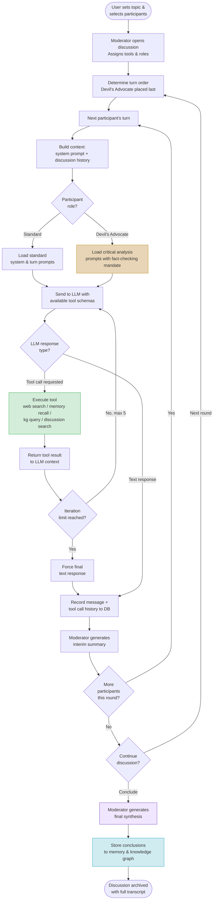

# Consensus: Collective Intelligence Through Structured Deliberation

## Beyond Chat — Toward Systematic Inquiry

Most AI applications today follow a simple pattern: one human, one model, one conversation. This works well for quick questions and drafting tasks, but it falls apart when problems demand rigour. Complex questions — the kind that shape policy, guide medical decisions, or determine architectural trade-offs — require multiple perspectives, adversarial testing, accumulated knowledge, and access to verifiable evidence. They require *deliberation*, not just generation.

Consensus is built around a different premise: that the most reliable path to understanding runs through structured, multi-party discussion — moderated, evidence-grounded, and persistent. Recent additions to the platform — institutional memory, the Devil's Advocate role, and a planned plugin system for domain specialists — transform it from a novel discussion tool into a framework for systematic cooperative inquiry.

This is not an isolated idea. A growing body of research — from Du et al.'s foundational work showing that [multi-agent debate improves factuality and reasoning](https://composable-models.github.io/llm_debate/) in language models, to recent surveys on [memory in LLM-based multi-agent systems](https://www.techrxiv.org/users/1007269/articles/1367390), to empirical studies demonstrating that [LLM-powered devil's advocates significantly improve group decision accuracy](https://dl.acm.org/doi/10.1145/3640543.3645199) — confirms that the principles underlying Consensus are sound. What Consensus adds is the integration: combining these individually validated techniques into a single, usable platform.

## Institutional Memory: Learning Across Conversations

Human experts do not approach each problem from scratch. A physician draws on decades of cases. A senior engineer recalls how a similar system failed three years ago. Institutional knowledge — the accumulated understanding of an organisation or discipline — is what separates competent analysis from shallow reaction.

Consensus gives its AI participants this same capacity through three interlocking memory systems:

**Personal memory** allows each AI entity to store observations, positions, and insights that persist across discussions. An AI participant that has spent several sessions debating the ethics of algorithmic sentencing does not forget its earlier reasoning when the topic resurfaces months later. It can recall its own prior positions, notice when new evidence contradicts them, and evolve its thinking over time. This is not mere retrieval — it is the foundation for intellectual continuity.

**Semantic search over past discussions** indexes the full corpus of prior conversations using vector embeddings (via Ollama and models like `nomic-embed-text`). Any participant can search not just for keywords but for *meaning* — finding relevant passages from earlier deliberations even when the vocabulary differs. A discussion about drug interactions can surface insights from a months-old conversation about metabolic pathways, because the system understands conceptual proximity, not just string matching.

**The knowledge graph** captures structured relationships between concepts: that a particular study *supports* a specific claim, that one architectural pattern *contradicts* another, that a philosophical position *implies* certain ethical commitments. Participants can assert new relationships and query existing ones, building a shared map of how ideas connect. Over time, this graph becomes a navigable representation of everything the group has learned together.

These are not passive archives. The system's default prompts actively instruct AI participants to search their memory before responding, to store key insights after contributing, and to record conceptual relationships as they emerge. Memory use is woven into the fabric of participation itself.

This approach resonates with recent work in the field. [Letta](https://github.com/letta-ai/letta) (formerly MemGPT) pioneered the idea of an OS-inspired memory hierarchy for AI agents — core memory, conversational memory, and archival memory — where agents actively manage what stays in context versus what gets stored externally. [Mem0](https://github.com/mem0ai/mem0) provides a lightweight open-source memory engine with graph-based storage. And the [MemOS](https://statics.memtensor.com.cn/files/MemOS_0707.pdf) preprint (July 2025) envisions a full "memory operating system" with conflict detection, deduplication, versioning, and forgetting policies. What distinguishes Consensus's memory architecture is its orientation toward *multi-party deliberation* rather than single-agent persistence: the knowledge graph and discussion corpus are shared resources that accumulate collective understanding, not just individual recall.

## The Devil's Advocate: Adversarial Rigour Without Hostility

Consensus and agreement feel productive, but they can be dangerous. Groupthink — the tendency of deliberating groups to converge on comfortable conclusions — is one of the most well-documented failures in collective decision-making. It has contributed to engineering disasters, medical errors, and policy failures.

The Devil's Advocate role in Consensus is a structural countermeasure. When a participant is assigned this role, the system does several things automatically:

**Specialised prompts** replace the standard participant instructions with a mandate for constructive critical analysis. The Devil's Advocate is directed to identify factual errors, logical fallacies, unsupported claims, unstated assumptions, and missing perspectives. Crucially, the instructions emphasise that this is not contrarianism for its own sake — the goal is to *strengthen* the discussion by subjecting every argument to honest scrutiny.

**Automatic tool assignment** gives the Devil's Advocate immediate access to web search and the full memory toolkit. The role's prompts explicitly require fact-checking claims made by other participants, searching for contradicting evidence, and grounding critiques in verifiable sources rather than mere assertion.

**Turn order placement** positions the Devil's Advocate last in each round of discussion. This is deliberate: by speaking after all other participants have contributed, the critic has the full picture of the round's arguments and can respond to the strongest versions of each position rather than attacking early, incomplete formulations.

**Single-advocate enforcement** ensures that only one participant holds this role at any time, preventing the discussion from devolving into a chorus of criticism. If a new Devil's Advocate is designated, the previous one reverts to a standard participant role.

The result is a discussion dynamic that mirrors the best practices of academic peer review, red-teaming in security, and moot court in legal education — adversarial testing conducted within a framework of mutual respect and shared purpose.

Empirical research validates this design. A 2024 study at the ACM Conference on Intelligent User Interfaces found that [groups with an LLM-powered devil's advocate showed significantly higher accuracy](https://dl.acm.org/doi/10.1145/3640543.3645199) on decision-making tasks, circumventing the limitations of traditional devil's advocacy where human dissenters often self-censor under social pressure. More recently, [Amplifying Minority Voices](https://arxiv.org/html/2502.06251v1) (February 2025) extends the concept toward equity, using AI-mediated devil's advocacy specifically to ensure marginalised perspectives are not drowned out. And the [RedDebate](https://arxiv.org/html/2506.11083v1) framework (June 2025) demonstrates that the same adversarial debate pattern can be turned inward — agents red-teaming each other to identify unsafe behaviours — suggesting that Consensus's Devil's Advocate role could serve double duty as a safety mechanism. The [D3 (Debate, Deliberate, Decide)](https://arxiv.org/html/2410.04663) framework formalises this further, defining role-specialised agents — advocates, judges, and optional juries — that map directly onto Consensus's existing architecture of moderator, participants, and Devil's Advocate.

## Specialist Plugins: Domain Expertise on Demand

The planned plugin system extends Consensus from general deliberation into domain-specific inquiry. The architecture is straightforward: specialist plugins are tool providers — external services that AI participants can invoke during a discussion to access domain-specific knowledge and capabilities.

Consider the medical specialist described in the roadmap: an LLM plugin backed by Medline search. During a discussion about treatment options for a rare condition, any participant could invoke this specialist to retrieve current evidence from the biomedical literature, check whether a cited study actually supports the claim being made, or request a structured summary of the current state of evidence for a particular intervention.

The infrastructure for this already exists. The tool system's `ToolProvider` abstraction supports both local Python implementations and external MCP (Model Context Protocol) servers. The tool registry handles access control, assignment, and execution. What remains is building the specialist providers themselves — but the connective tissue is in place.

This design creates a natural parallel to how expert consultation works in practice. A panel of physicians discussing a difficult case can call in a radiologist to interpret imaging. A software architecture review can bring in a security specialist to evaluate a proposed design. In Consensus, these consultations happen within the discussion flow, with results visible to all participants and subject to the same critical scrutiny as any other contribution.

The timing is right for this approach. Anthropic's [Model Context Protocol (MCP)](https://modelcontextprotocol.io/) — now an open standard under the Linux Foundation with over 10,000 public servers — provides exactly the interoperability layer that specialist plugins need. MCP servers already exist for PubMed, legal databases, code repositories, and dozens of other domain-specific knowledge sources. Consensus's planned `MCPToolProvider` could connect to any of these with minimal integration work, turning the growing MCP ecosystem into an instant library of specialist capabilities.

## Multi-Angle Inquiry in Practice

These features are individually useful, but their power is combinatorial. Together, they enable a mode of inquiry that is difficult to achieve with any single tool or interaction pattern.

### Software Engineering

A team evaluating whether to adopt a new database technology could convene a Consensus discussion with participants representing different concerns — performance, operational complexity, data integrity, migration risk. The Devil's Advocate systematically challenges optimistic assumptions, using web search to find post-mortems from organisations that attempted similar migrations. Memory tools recall relevant conclusions from earlier architecture discussions. A database specialist plugin could query benchmark databases and compatibility matrices. The moderator synthesises the discussion into a structured decision document, with dissenting views and their supporting evidence preserved rather than smoothed away.

### Philosophy and Ethics

Ethical questions resist simple answers precisely because they involve genuine tensions between competing values. A Consensus discussion about the ethics of predictive policing could include participants representing utilitarian, deontological, and virtue ethics perspectives. The Devil's Advocate challenges each framework's blind spots — pressing the utilitarian on distributional justice, the deontologist on consequences, the virtue ethicist on institutional constraints. The knowledge graph accumulates the conceptual relationships between arguments across sessions, building a structured map of the ethical landscape that grows more nuanced with each discussion.

### Medical Questions

A discussion about optimal management of a complex patient case could involve AI participants with different clinical perspectives — a generalist, a specialist in the relevant organ system, and a pharmacologist. The Devil's Advocate fact-checks clinical claims against current evidence via web search and specialist plugins querying PubMed and clinical trial registries. Memory tools recall relevant cases discussed previously. The knowledge graph captures causal relationships between conditions, treatments, and outcomes. The discussion produces not a single recommendation but a structured analysis of options, evidence quality, and areas of genuine uncertainty — exactly what clinical decision-making demands.

This is not speculative. Recent research demonstrates that multi-agent medical AI systems measurably outperform single-model approaches. The [Multi-Agent Conversation (MAC) framework](https://www.nature.com/articles/s41746-025-01550-0), published in *npj Digital Medicine* (2025), uses a supervisor agent and three doctor agents inspired by clinical multi-disciplinary team discussions, achieving higher diagnostic accuracy in both primary and follow-up consultations. [MDAgents](https://arxiv.org/html/2404.15155v2) introduces adaptive complexity routing — simple questions go to a single clinician agent, while complex cases escalate to a full multi-disciplinary team — a triage pattern that could inform Consensus's specialist plugin design. The [Multi-Agent Medical Decision Consensus Matrix](https://arxiv.org/pdf/2512.14321) (December 2025) formalises how to aggregate specialist opinions, achieving consensus rates of 89.3% with measurably improved accuracy. And [TeamMedAgents](https://arxiv.org/pdf/2508.08115) demonstrates 2–10 percentage point improvements over single-agent baselines through structured teamwork components — empirical confirmation that roles like the Devil's Advocate are not merely decorative. Perhaps most striking, multi-agent systems have been shown to [mitigate clinical decision biases](https://www.techrxiv.org/doi/full/10.36227/techrxiv.176089343.36199495/v1), improving accuracy from 0% to 76% on bias-containing complex cases.

### With or Without Humans in the Loop

A defining feature of Consensus is that humans and AI participants coexist as equals within the same deliberative framework. A human moderator can guide a panel of AI specialists. A human domain expert can contribute alongside AI participants who handle literature search and evidence synthesis. Or a fully autonomous panel of AI entities can deliberate on a question while a human observer reviews the transcript and intervenes only when needed.

This flexibility matters because the optimal level of human involvement varies by context. Exploratory philosophical discussions may benefit from a human moderator who can redirect unproductive lines of argument. Medical evidence synthesis may work best with AI participants doing the heavy lifting of literature search and a human clinician providing clinical judgement. Software architecture reviews may alternate between autonomous AI analysis and human decision-making at key branch points.

The system does not prescribe the right balance. It provides the structure — moderation, turn-taking, memory, adversarial testing, specialist consultation — and lets users configure it for their needs.

## How a Discussion Flows

The following diagram illustrates the lifecycle of a single discussion round in Consensus — from topic selection through moderated turns with tool use, adversarial critique, and synthesis.

## How the Memory System Works

This diagram traces the data flow through Consensus's three-layer memory architecture: personal memory, semantic discussion search, and the knowledge graph.

```mermaid
flowchart TD
    subgraph TURN["During a Participant's Turn"]
        BEFORE[Before responding:<br/>search existing knowledge]
        AFTER[After contributing:<br/>store new knowledge]
    end

    subgraph PERSONAL["Personal Memory"]
        direction TB
        RECALL["<b>memory_recall</b><br/>Semantic search over<br/>this entity's memories"]
        STORE_MEM["<b>memory_store</b><br/>Save observation, position,<br/>or insight"]
        FORGET["<b>memory_forget</b><br/>Delete outdated memory"]
        MEM_DB[("entity_memories<br/>+ embeddings<br/><i>scoped per entity</i>")]

        RECALL <--> MEM_DB
        STORE_MEM --> MEM_DB
        FORGET --> MEM_DB
    end

    subgraph DISCUSSION["Discussion Corpus Search"]
        direction TB
        DISC_SEARCH["<b>discussion_search</b><br/>Semantic search across<br/>all past discussions"]
        LAZY["Lazy indexing:<br/>embed unindexed messages<br/>in background on first query"]
        MSG_DB[("message_embeddings<br/>+ discussion metadata<br/><i>shared across entities</i>")]

        DISC_SEARCH <--> MSG_DB
        LAZY --> MSG_DB
    end

    subgraph KG["Knowledge Graph"]
        direction TB
        ASSERT["<b>kg_assert</b><br/>Assert a relationship triple<br/><i>e.g. free will --[contradicts]--> determinism</i>"]
        QUERY["<b>kg_query</b><br/>Search nodes semantically<br/>or traverse neighbours"]
        KG_DB[("kg_nodes + kg_edges<br/>+ node embeddings<br/><i>shared, cumulative</i>")]

        ASSERT --> KG_DB
        QUERY <--> KG_DB
    end

    subgraph EMBED["Embedding Pipeline"]
        direction LR
        OLLAMA["Ollama API<br/><i>localhost:11434</i>"]
        MODEL["nomic-embed-text<br/><i>768-dim vectors</i>"]
        COSINE["Cosine similarity<br/>ranking"]
        OLLAMA --- MODEL --- COSINE
    end

    BEFORE --> RECALL
    BEFORE --> DISC_SEARCH
    BEFORE --> QUERY

    AFTER --> STORE_MEM
    AFTER --> ASSERT

    RECALL -.->|embed query| EMBED
    DISC_SEARCH -.->|embed query| EMBED
    QUERY -.->|embed query| EMBED
    STORE_MEM -.->|embed content<br/>async background| EMBED
    ASSERT -.->|embed nodes<br/>async background| EMBED
    LAZY -.->|embed messages<br/>async background| EMBED

    style TURN fill:#fff3cd,stroke:#ffc107
    style PERSONAL fill:#e8f4fd,stroke:#0d6efd
    style DISCUSSION fill:#d4edda,stroke:#198754
    style KG fill:#f0e6ff,stroke:#6f42c1
    style EMBED fill:#f8f9fa,stroke:#6c757d
```

### Reading the Memory Diagram

The memory system operates on a simple principle: **search before you speak, store after you contribute**.

Before generating a response, a participant queries all three layers — recalling its own prior positions, searching past discussions for relevant arguments, and checking the knowledge graph for established relationships. After contributing, it stores key insights to personal memory and asserts new conceptual relationships to the shared knowledge graph.

All text — queries, memories, messages, graph node labels — flows through the same embedding pipeline (Ollama running locally), producing 768-dimensional vectors that enable semantic similarity search. Storage operations (embedding new content) run asynchronously in the background so they never block the discussion flow. Retrieval operations (searching for similar content) embed the query synchronously, then rank stored vectors by cosine similarity.

The three layers serve complementary purposes: personal memory tracks an entity's own evolving positions, discussion search surfaces evidence and arguments from the full historical corpus, and the knowledge graph captures structured relationships that transcend any single conversation.

## Consensus in the Landscape

Consensus exists at the intersection of several active research threads and established platforms, drawing from each while combining them in a way that none do individually.

### Multi-Agent Debate Frameworks

The theoretical foundations are well established. [Multi-Agents Debate (MAD)](https://github.com/Skytliang/Multi-Agents-Debate) was the first framework to explore multi-agent debate with LLMs. [Du et al.'s ICML 2024 paper](https://composable-models.github.io/llm_debate/) proved that multi-agent debate improves both factuality and reasoning. [Agent4Debate](https://github.com/zhangyiqun018/agent-for-debate) (ICASSP 2026) achieves human-level competitive debate through dynamic agent coordination. And [LLM-Agora](https://github.com/gauss5930/LLM-Agora) validates that the approach works with open-source models, not just proprietary ones. These frameworks focus on debate as a mechanism for improving model outputs. Consensus extends the pattern into a persistent, user-facing platform with moderation, memory, and tool access — debate as a *method of inquiry*, not just an inference-time technique.

Recent preprints sharpen the picture further. ["From Lazy Agents to Deliberation"](https://arxiv.org/abs/2511.02303) (November 2025) identifies the "lazy agent" problem — where one agent dominates while others contribute little — validating Consensus's enforced turn-taking and turn-order management. ["Can LLM Agents Really Debate?"](https://arxiv.org/pdf/2511.07784) (November 2025) runs controlled experiments on what makes multi-agent debate actually effective, finding that diverse reasoning paths and explicit role assignments — both core Consensus features — are critical success factors. And the [Hashgraph-Inspired Consensus Mechanism](https://arxiv.org/html/2505.03553v1) (May 2025) applies formal distributed-systems consensus protocols to multi-model reasoning, pointing toward theoretical guarantees that could eventually underpin platforms like Consensus.

### Structured Human Deliberation

On the human side, [Kialo](https://en.wikipedia.org/wiki/Kialo) provides structured debate with hierarchical argument trees — pro/con branches under user-submitted theses. Its strength is in *mapping* the structure of arguments visually, something Consensus's knowledge graph approaches from the AI side. [Polis](https://compdemocracy.org/polis/), the open-source civic deliberation platform, takes a different approach: short statements voted on by large groups, with ML clustering to surface areas of agreement. Polis has been [credited with assisting the passage of legislation in Taiwan](https://en.wikipedia.org/wiki/Pol.is). [Research on integrating LLMs with Polis](https://arxiv.org/html/2306.11932) is underway, exploring AI-assisted moderation and summarisation of large-scale civic deliberation — a complementary approach to Consensus's deep, small-group discussions.

### Agent Frameworks

General-purpose multi-agent frameworks like [AutoGen](https://github.com/microsoft/autogen) (Microsoft) and [CrewAI](https://www.crewai.com/) provide conversation-driven and role-based agent orchestration respectively. These are infrastructure — they provide the plumbing for multi-agent interaction but not the deliberation-specific features (adversarial roles, institutional memory, knowledge graphs, moderated turn-taking) that make structured inquiry productive. Consensus is more opinionated by design: it encodes a particular theory of how groups reason well, rather than providing a general-purpose agent coordination layer.

### Where Consensus Differs

Most related projects address one dimension of what Consensus combines. Debate frameworks do argumentation without persistence. Memory systems serve single agents rather than deliberating groups. Medical multi-agent systems exist as research prototypes rather than user-facing platforms. Civic deliberation tools handle humans but not AI participants. Agent frameworks provide infrastructure without deliberation-specific structure.

Consensus's contribution is the integration: structured turn-taking that prevents voices from being drowned out, moderation that keeps discussions productive, persistent memory that builds knowledge over time, adversarial testing that catches errors before they solidify, specialist access that grounds deliberation in evidence, and a hybrid human-AI participation model that adapts to the needs of each inquiry. No single related project combines all of these — and the research increasingly suggests that the combination is what matters.

## The Architecture of Careful Thinking

What makes Consensus distinctive is not any single feature but the *combination*: structured turn-taking that prevents voices from being drowned out, moderation that ensures discussions stay productive, persistent memory that builds knowledge over time, adversarial testing that catches errors before they calcify into assumptions, and specialist access that grounds deliberation in verifiable evidence.

This combination mirrors what works in the best human institutions — peer review, structured debate, red-teaming, expert consultation — while removing the bottlenecks that make those processes slow and expensive. A Consensus discussion can convene in seconds, draw on the full breadth of available knowledge, and produce structured outputs that preserve not just conclusions but the reasoning and evidence that led to them.

The ambition is not to replace human judgement but to augment it — to provide a framework in which hard questions can be investigated systematically, from multiple angles, with the intellectual honesty that comes from building adversarial scrutiny into the process itself. Whether the question is which database to choose, whether an algorithm is fair, or how to treat a rare disease, the method is the same: gather perspectives, challenge assumptions, check the evidence, and reason carefully together.

That is what collective intelligence looks like when you engineer it deliberately.

---

## References

### Multi-Agent Debate

- Du, Y., Li, S., Torralba, A., Tenenbaum, J.B., & Mordatch, I. (2023). [Improving Factuality and Reasoning in Language Models through Multiagent Debate](https://composable-models.github.io/llm_debate/). *ICML 2024*.
- Liang, T. et al. [Multi-Agents Debate (MAD)](https://github.com/Skytliang/Multi-Agents-Debate). GitHub.
- Zhang, Y. et al. [Agent4Debate: Dynamic Multi-Agent Framework for Competitive Debate](https://github.com/zhangyiqun018/agent-for-debate). *ICASSP 2026*.
- Chan, C. et al. (2023). [ChatEval: Towards Better LLM-based Evaluators through Multi-Agent Debate](https://arxiv.org/abs/2308.07201).
- Kim, S. et al. (2023). [LLM-Agora: Debating between Open-Source LLMs](https://github.com/gauss5930/LLM-Agora). GitHub.
- Smit, R. et al. [DebateLLM: Benchmarking Multi-Agent Debate for Truthfulness](https://github.com/instadeepai/DebateLLM). InstaDeep.
- [Multi-LLM-Agents Debate: Performance, Efficiency, and Scaling Challenges](https://d2jud02ci9yv69.cloudfront.net/2025-04-28-mad-159/blog/mad/). *ICLR Blogposts 2025*.

### Adversarial Reasoning and Devil's Advocate

- Chiang, C.-W. et al. (2024). [Enhancing AI-Assisted Group Decision Making through LLM-Powered Devil's Advocate](https://dl.acm.org/doi/10.1145/3640543.3645199). *ACM IUI 2024*.
- Park, J. et al. (2025). [Amplifying Minority Voices: AI-Mediated Devil's Advocate System for Inclusive Group Decision-Making](https://arxiv.org/html/2502.06251v1).
- Chen, Y. et al. (2025). [RedDebate: Safer Responses through Multi-Agent Red Teaming Debates](https://arxiv.org/html/2506.11083v1).
- Estornell, A. et al. (2024). [D3: Debate, Deliberate, Decide — A Cost-Aware Adversarial Framework](https://arxiv.org/html/2410.04663).

### Memory for AI Agents

- Packer, C. et al. [Letta (MemGPT): Stateful Agents with Self-Editing Memory](https://github.com/letta-ai/letta). GitHub.
- Chhikara, P. et al. (2025). [Mem0: Building Production-Ready AI Agents with Scalable Long-Term Memory](https://arxiv.org/pdf/2504.19413).
- MemTensor. (2025). [MemOS: A Memory OS for AI Systems](https://statics.memtensor.com.cn/files/MemOS_0707.pdf). Preprint.
- [Memory in LLM-based Multi-agent Systems: Mechanisms, Challenges, and Collective](https://www.techrxiv.org/users/1007269/articles/1367390). *TechRxiv*.

### Medical Multi-Agent Systems

- Lin, Z. et al. (2025). [Enhancing Diagnostic Capability with Multi-Agent Conversational LLMs](https://www.nature.com/articles/s41746-025-01550-0). *npj Digital Medicine*.
- Kim, J. et al. (2024). [MDAgents: An Adaptive Collaboration of LLMs for Medical Decision-Making](https://arxiv.org/html/2404.15155v2).
- [Multi-Agent Medical Decision Consensus Matrix](https://arxiv.org/pdf/2512.14321). December 2025.
- [TeamMedAgents: Enhancing Medical Decision-Making](https://arxiv.org/pdf/2508.08115). August 2025.
- Zhang, Y. et al. (2025). [MedLA: A Logic-Driven Multi-Agent Framework for Complex Medical Reasoning](https://arxiv.org/html/2509.23725v1).
- [A Survey of LLM-based Multi-agent Systems in Medicine](https://www.techrxiv.org/doi/full/10.36227/techrxiv.176089343.36199495/v1). *TechRxiv*.

### Multi-Agent Reasoning (Preprints)

- Li, Z. et al. (2025). [Unlocking the Power of Multi-Agent LLM for Reasoning: From Lazy Agents to Deliberation](https://arxiv.org/abs/2511.02303).
- [Can LLM Agents Really Debate?](https://arxiv.org/pdf/2511.07784). November 2025.
- [A Hashgraph-Inspired Consensus Mechanism for Reliable Multi-Model Reasoning](https://arxiv.org/html/2505.03553v1). May 2025.
- [AgentsNet: Coordination and Collaborative Reasoning in Multi-Agent LLMs](https://arxiv.org/html/2507.08616v1). July 2025.

### Deliberation Platforms

- [Kialo: Online Structured Debate Platform](https://en.wikipedia.org/wiki/Kialo).
- [Polis: Open-Source Platform for Civic Deliberation](https://compdemocracy.org/polis/).
- Small, C. et al. (2023). [Opportunities and Risks of LLMs for Scalable Deliberation with Polis](https://arxiv.org/html/2306.11932).

### Infrastructure

- Anthropic. (2024). [Introducing the Model Context Protocol](https://www.anthropic.com/news/model-context-protocol).
- [Model Context Protocol Specification](https://modelcontextprotocol.io/).
- [Schepis, E. Patterns for Democratic Multi-Agent AI: Debate-Based Consensus](https://medium.com/@edoardo.schepis/patterns-for-democratic-multi-agent-ai-debate-based-consensus-part-1-8ef80557ff8a). Medium.
